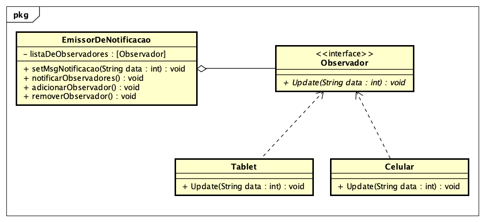

<h1> Observer </h1>

Observer é um padrao que consiste na ideia de implementar um sistema assinaturas. Existem duas entidade principais o Sujeito e os Observadores.

O sujeito mantem uma lista de observadores e é possivel adicionar ou retirar novos observadores.

O Observador é o objeto que esta aguardando uma mensagem do sujeito com mudancas e ele contem um metodo para atualizar seus registros quando essa mensagem chega do sujeito.

<h2>Exemplo:</h2>



  
  
  <h3>Sujeito emissor de notificacao: </h3>
  
  ```Java
  
public class EmissorDeNotificacao {

	  ArrayList<Observador> listaDeObservadores;
	    String msgNotificacao;
	  
	    public EmissorDeNotificacao(){
	      listaDeObservadores = new ArrayList<Observador>();
	  }
	    
	    public void setMsgNotificacao(String data) {
	    	msgNotificacao = data;
	    	notificarObservadores();
	    }
	    
	    public void notificarObservadores() {
	    	for (Observador observador : listaDeObservadores) {
	    		observador.update(msgNotificacao);
	    	}
	    }
	    
	    public void adicionarObservador(Observador observador) {
	    	listaDeObservadores.add(observador);
	    }
	    
	    public void removerObservador(Observador observador) {
	    	int i = listaDeObservadores.indexOf(observador);
	    	if ( i>= 0 ) {
	    		listaDeObservadores.remove(i);
	    	}
	    	
	    }
  
  ```
  
  <h3>Interface do observador: </h3>
  
  ```Java
  public interface Observador {
    public void update(String data);
  }
  ```
  
  
  <h3>Observador 1: </h3>
  
  ```Java
  public class Tablet  implements Observador{
		
		public Tablet(EmissorDeNotificacao emissor) {
			emissor.adicionarObservador(this);
		}
		
		
		public void update(String data) {
			System.out.print(data);
		}

	}
  
  ```
  
  <h3>Observador 2: </h3>
  
  ```Java
  public class Celular implements Observador{
	
	
	
	public Celular(EmissorDeNotificacao emissor) {
		emissor.adicionarObservador(this);
	}
	
	
	public void update(String data) {
		System.out.print(data);
	}

}

  
  ```
