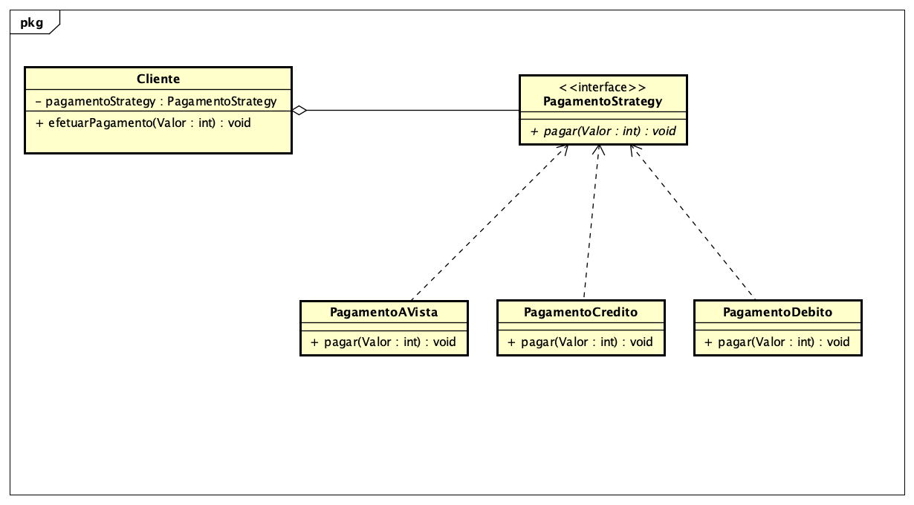

<h1>Strategy</h1>

Strategy é um padrão de projeto utilizado quando precisamos de mais flexibilidade no comportamento de nossos objetos.

A ideia consiste em criar uma familia de algoritmos separadas em outras classes, tendo assim a flexibilidade de selecionar o algoritmo desejado caso a caso
e ate mesmo alterar esta seleção durante a execucao do programa

No exemplo abaixo eu desenvolvi um diagrama que implementa o padrao strategy para definir qual a forma de pagamento um cliente gostaria de efetuar:




<h2>Exemplo no codigo: </h2>


<h3>Classe cliente </h3>

``` Java
public class Cliente{
   PagamentoStrategy pagamentoStrategy;
 
   public Cliente(){
    pagamentoStrategy = new PagamentoAVista();
   }
 
   public void efetuarPagamento(int Valor){
    pagamentoStrategy.pagar(Valor);
   }
   
   public void setPagamentoStrategy(PagamentoStrategy pagamentoStrategy) {
    this.pagamentoStrategy = pagamentoStrategy;
   }   
 }
```

<h3>Interface PagamentoStrategy </h3>

```Java
public interface PagamentoStrategy{
  public void pagar(int Valor);
}
```

<h3>Classe pagamentoAVista </h3>

```Java
public class PagamentoAVista implements PagamentoStrategy{
  public void pagar(int Valor){
    System.out.printf("Pagamento no valor %d foi realizado a vista!", Valor);
  }
}
```

<h3>Classe pagamentoCredito </h3>

```Java
public class PagamentoCredito implements PagamentoStrategy{
  public void pagar(int Valor){
    System.out.printf("Pagamento no valor %d foi realizado no credito!", Valor);
  }
}
```

<h3>Classe pagamentoDebito </h3>

```Java
public class PagamentoDebito implements PagamentoStrategy{
  public void pagar(int Valor){
    System.out.printf("Pagamento no valor %d foi realizado no Debito!", Valor);
  }
}
```
